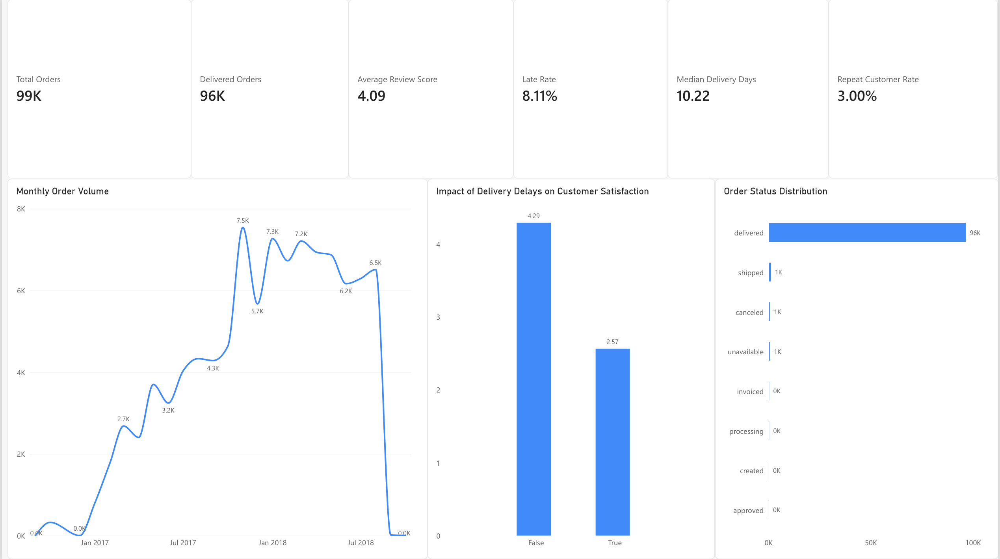
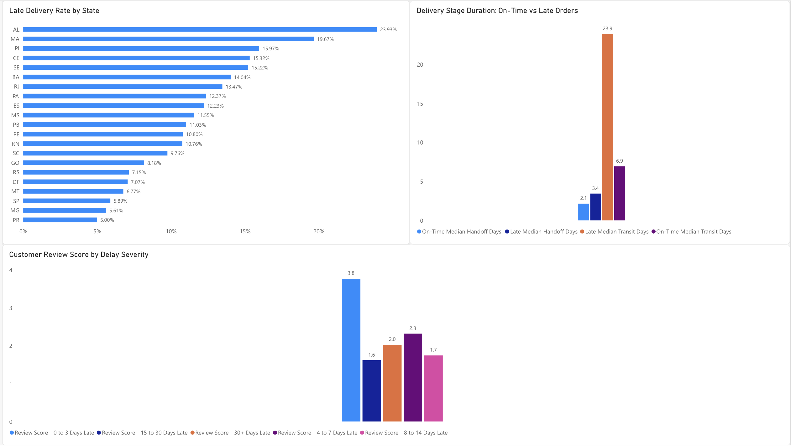
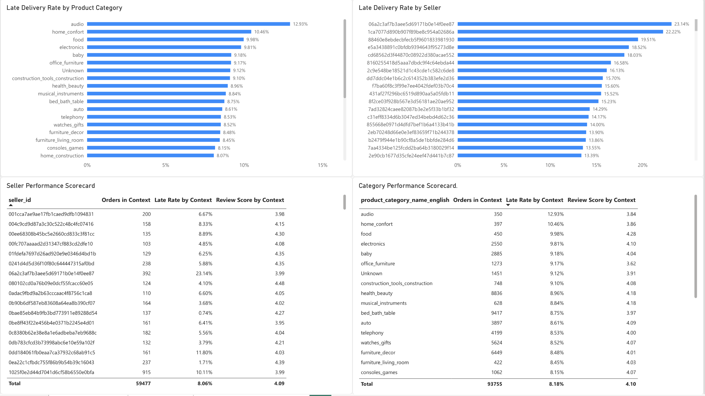

# Olist E-Commerce Operations & Customer Experience Analytics

**End-to-end Data Analytics Portfolio Project | Python · PostgreSQL · SQL · Power BI**

Analyzed **99,441 e-commerce orders** to identify delivery-performance risks, customer-experience patterns, geographic hotspots, and seller/category performance issues.

### Key Results at a Glance

- **96,470** delivered orders with measurable delivery performance
- **8.11%** late-delivery rate
- **4.29 → 2.57** average review score for on-time vs. late orders
- **6.92 → 23.92 days** median post-handoff transit time for on-time vs. late orders
- **3.00%** repeat-customer rate within the observed dataset period 

## Project Overview

This project analyzes the Brazilian Olist e-commerce dataset to identify operational performance issues and understand how delivery performance relates to customer experience.

The analysis focuses on the complete analytics workflow: data cleaning and validation in Python, relational analysis in PostgreSQL/SQL, business-focused exploratory analysis, and interactive reporting in Power BI.

Rather than treating the dataset as a general exploratory analysis exercise, the project is structured around practical business questions related to delivery performance, customer satisfaction, geographic risk, seller and product-category performance, and customer retention.

## Business Questions

The project investigates the following questions:

- How frequently are delivered orders late?
- Which stage of the delivery process shows the largest difference between on-time and late orders?
- How is delivery delay associated with customer review scores?
- Which states have the highest late-delivery rates and operational impact?
- Which product categories and sellers are associated with higher late-delivery rates?
- What payment patterns appear in the observed transactions?
- What proportion of customers place repeat delivered orders within the observed dataset period?

## Tools & Technologies

- **Python:** Pandas, NumPy, Jupyter Notebook
- **SQL:** PostgreSQL
- **Business Intelligence:** Power BI
- **Data Analysis:** Data cleaning, validation, exploratory analysis, KPI development
- **Data Modeling:** Order-level fact table, dimensional tables, relationship validation
- **Version Control:** Git & GitHub

## Key Findings

- **96,470 delivered orders** had sufficient data for delivery-performance measurement, and **7,826 were late**, producing an overall late-delivery rate of **8.11%**.
- Median delivery time was **10.22 days**, while the average was **12.56 days**.
- Late delivery was strongly associated with lower customer satisfaction: average review score fell from **4.29 for on-time deliveries** to **2.57 for late deliveries**.
- The largest observed delivery-stage difference appeared after carrier handoff. Median transit time increased from **6.92 days for on-time orders** to **23.92 days for late orders**.
- Geographic performance varied substantially. Among states with at least 300 delivered orders, **Alagoas (AL)** had the highest late-delivery rate at **23.93%**, while **Rio de Janeiro (RJ)** represented a larger operational impact with **1,664 late orders** and a **13.47% late rate**.
- Product-category performance also varied. Among categories meeting the analysis volume threshold, **Audio** had the highest observed late-delivery rate at approximately **12.93%**.
- Seller-level analysis identified substantial performance variation among higher-volume sellers, providing candidates for operational monitoring and investigation.
- Only **3.00% of customers with delivered orders** placed more than one delivered order within the observed dataset period. Those repeat customers accounted for **6.14% of delivered orders**.

## Power BI Dashboard

The Power BI report translates the analysis into three business-focused dashboard pages covering executive KPIs, delivery and customer experience, and seller/category performance.

### Executive Overview



### Delivery & Customer Experience



### Seller & Category Performance

 
## Analysis Workflow

### 1. Data Cleaning & Validation — Python

The raw Olist datasets were inspected and cleaned using Pandas and NumPy.

Key preparation steps included:

- Validating dataset shapes, keys, duplicates, and relationships
- Converting order lifecycle fields to appropriate datetime types
- Removing exact duplicate geolocation records
- Standardizing product category names and English translations
- Preserving meaningful missing values rather than automatically replacing them
- Identifying invalid negative delivery-stage durations and excluding them from derived metrics
- Creating operational features including delivery time, delivery delay, carrier handoff time, transit time, and late-delivery indicators
- Aggregating payments and reviews to appropriate analytical grains
- Validating relationships between orders, customers, products, sellers, payments, reviews, and order items

A final order-level analytical fact table was created while preserving separate item-, payment-, and review-level datasets where their original grain was required.

### 2. Exploratory & Business Analysis — Python

Exploratory analysis was used to investigate:

- Order volume and status distribution
- Delivery performance and delay severity
- Delivery performance versus customer review scores
- Geographic delivery performance
- Product-category performance
- Seller performance
- Payment behavior
- Repeat-customer behavior

Special attention was given to avoiding double counting when orders contained multiple products, categories, sellers, payments, or reviews.

### 3. Relational Analysis — PostgreSQL

The cleaned datasets were loaded into PostgreSQL and analyzed using SQL.

The SQL workflow includes:

- Schema creation
- Row-count and key validation
- Referential-integrity checks
- Data-quality exception checks
- Delivery KPI calculations
- Geographic performance analysis
- Seller and product-category scorecards
- Payment analysis
- Repeat-customer analysis

SQL outputs were cross-checked against the Python analysis to validate consistency.

### 4. Dashboard — Power BI

A three-page Power BI report was developed:

1. **Executive Overview** — headline KPIs, order trends, customer satisfaction impact, and order status
2. **Delivery & CX** — geographic delivery risk, delivery-stage performance, and customer review impact
3. **Seller & Category Performance** — seller and product-category late-delivery analysis and performance scorecards

The Power BI semantic model maintains the appropriate relationships between orders, order items, products, sellers, customers, and payments.

## Repository Structure

```text
Olist-E-Commerce-Operations-Customer-Experience-Analytics-SQL-Power-BI-Python/
│
├── Data/
│   └── processed/
│       ├── dim_customers.csv
│       ├── dim_geolocation_zip.csv
│       ├── dim_products.csv
│       ├── dim_sellers.csv
│       ├── fact_order_items.csv
│       ├── fact_orders.csv
│       ├── fact_payments.csv
│       └── fact_reviews.csv
│
├── notebooks/
│   ├── 01_data_cleaning.ipynb
│   ├── 02_eda_operations_cx.ipynb
│   └── 03_business_analysis.ipynb
│
├── SQL/
│   ├── 01_schema.sql
│   ├── 02_data_quality.sql
│   └── 03_business_queries.sql
│
├── PowerBI/
├── Docs/
└── README.md

Analytical Considerations & Limitations

* The analysis identifies associations rather than causal relationships. For example, late delivery is associated with lower review scores, but the dataset alone cannot establish that delivery delay caused a particular review.
* Orders can contain products from multiple categories and multiple sellers. Category- and seller-level analyses therefore use distinct order relationships to reduce double counting, but totals across categories or sellers should not be summed as if the groups were mutually exclusive.
* The dataset does not provide carrier identity, so longer post-handoff transit times cannot be attributed to a specific logistics provider.
* Repeat-customer metrics describe behavior within the observed dataset period and should not be interpreted as lifetime customer retention.
* The earliest and latest months in the dataset contain sparse observations, so monthly trend interpretation focuses primarily on the continuous core period.
* Missing review data is preserved as missing and is not interpreted as negative customer sentiment.
* Source timestamp anomalies were preserved where appropriate and invalid derived durations were excluded rather than replacing the underlying source values.

Business Recommendations

Based on the observed patterns, potential operational actions include:

1. Strengthen post-handoff delivery monitoring, since transit-stage duration shows the largest observed difference between on-time and late deliveries.
2. Prioritize high-impact geographic markets, particularly regions combining substantial order volume with elevated late-delivery rates.
3. Use proactive customer communication for delayed orders to manage expectations and potentially reduce the customer-experience impact of delivery problems.
4. Develop seller and product-category performance scorecards to identify recurring operational risk patterns and prioritize investigation.
5. Investigate retention opportunities, given the relatively small share of customers placing repeat delivered orders within the observed period.

## Dataset

This project uses the **Brazilian E-Commerce Public Dataset by Olist**, which contains approximately 100,000 orders placed across multiple Brazilian marketplaces.

The original raw CSV files and generated processed datasets are **not included in this repository** to keep the repository lightweight. They are excluded through `.gitignore`.

To reproduce the analysis:

1. Download the Brazilian E-Commerce Public Dataset by Olist from Kaggle.
2. Place the original CSV files inside the `Data/` directory.
3. Run `notebooks/01_data_cleaning.ipynb` to perform data cleaning, validation, feature engineering, and generate the processed analytical datasets.
4. Continue with `02_eda_operations_cx.ipynb` and `03_business_analysis.ipynb` for the analytical workflow.
5. Use the SQL scripts in `SQL/` for the PostgreSQL analysis.

The small `product_category_name_translation.csv` reference file is retained in the repository.